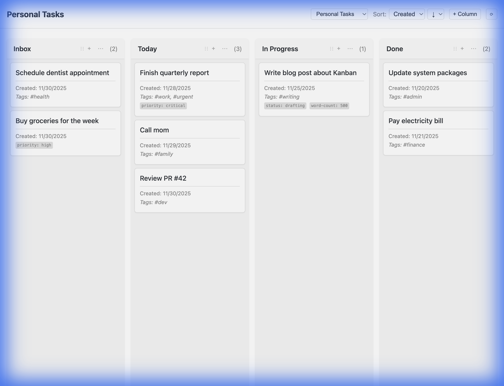

# Obsidian Kanban Board Plugin



A powerful, highly customizable Kanban board plugin for Obsidian. Transform your notes into a visual project management system with drag-and-drop simplicity and deep integration with your vault.

## ✨ Features

### 🎯 Visual Task Management
- **Drag & Drop Interface**: Intuitive card movement between columns.
- **Multiple Boards**: Create separate boards for different projects or areas of life.
- **Board Switching**: Quickly jump between boards with the built-in selector.

### 🎨 Rich Customization
- **Dynamic Columns**: Create columns based on any frontmatter property.
- **Custom Properties**: Display any frontmatter field on your cards (e.g., priority, tags, dates).
- **Flexible Sorting**: Sort cards by creation date, modification date, or title.
- **Theme Aware**: Seamlessly blends with your Obsidian theme, including dark mode support.

### 🛠 Powerful Workflows
- **Frontmatter Integration**: Cards are just notes with specific frontmatter - fully compatible with other plugins.
- **Auto-Refresh**: Boards automatically update when you modify files elsewhere.
- **Mobile Ready**: Fully responsive design that works great on phones and tablets.

## 🚀 Quick Start

1. **Install** the plugin from Community Plugins.
2. **Create a Note** with the following frontmatter:
   ```yaml
   ---
   status: "In Progress"
   priority: "high"
   tags: ["project-alpha"]
   ---
   ```
3. **Open the Kanban Board** from the ribbon or command palette.
4. **Create a Board** in settings pointing to your tag (e.g., `#project-alpha`).
5. **Start Organizing!** Drag cards, add columns, and customize your view.

## 📦 Installation

### From Community Plugins
1. Open Settings > Community Plugins
2. Turn off Safe Mode
3. Click Browse and search for "Kanban Board"
4. Click Install and then Enable

### Manual Installation
1. Download the latest release from the [Releases page](https://github.com/yourusername/obsidian-kanban-board/releases).
2. Extract the files to your vault's `.obsidian/plugins/kanban-board/` folder.
3. Reload Obsidian.

## 🔧 Configuration

Go to **Settings > Kanban Board** to configure:
- **Board Definitions**: Set up multiple boards with unique names and tag filters.
- **Column Mapping**: Define which property values map to which columns.
- **Card Appearance**: Choose which properties to display on cards.

## 🤝 Contributing

Contributions are welcome! Please see [CONTRIBUTING.md](CONTRIBUTING.md) for details.

## 📄 License

MIT License - see [LICENSE](LICENSE) for details.